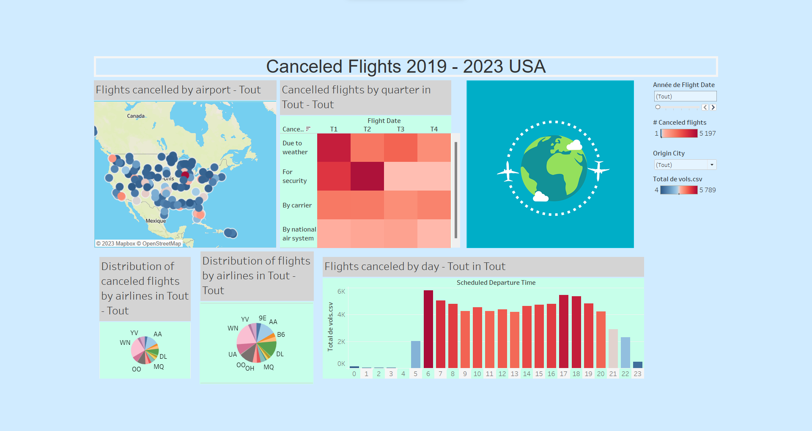
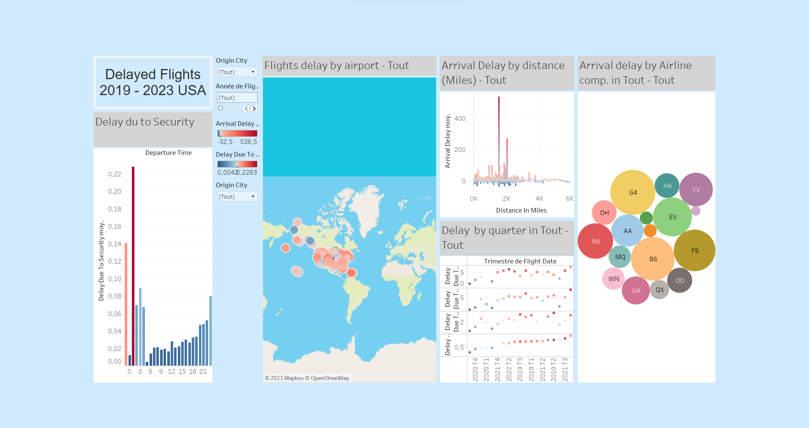

# US Flight Data Visualization Project (2019-2023)

## Overview
This project focuses on visualizing flight data in the United States from 2019 to 2023. Our primary goal is to process and visualize a sample of 3,000,000 flights from a larger dataset of 30 million flights. 

## Data Processing
The data preprocessing steps are documented in `preprocessing.ipynb`. This notebook includes all the necessary steps taken to prepare the data for visualization.

## Visualization Tools
We utilized Tableau for visualizing the processed dataset. The Tableau dashboards can be found in the `tableau/Dashboards.twb` file.

## Key Visualizations
The project specifically concentrates on two main aspects:

### Flight Cancellations

### Flight Delays

These dashboards provide in-depth insights into the patterns of delays and cancellations over the four-year period.

